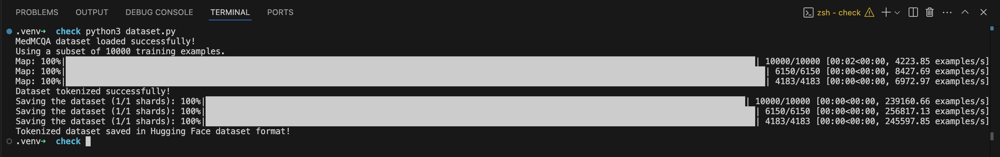

# Dataset Preparation  

The dataset chosen for this fine-tuning project is MedMCQA.  

The **MedMCQA dataset** (Medical Multiple Choice Question Answering) is used for training and evaluating machine learning models on the task of medical multiple-choice question answering. It is designed to assess how well a model can understand and reason about medical knowledge by answering multiple-choice questions related to various aspects of medicine.  

The dataset has been used in several research papers to test the ability of models, such as transformers and deep learning approaches, to perform well on medical question-answering (QA) tasks. This dataset is important in the context of developing AI systems that can assist in the medical field, such as virtual assistants for healthcare professionals or tools for medical students.  

**Expected Behavior after Training** – The model should be able to answer medical MCQs along with some explanation of the answer.  

After running the code to tokenize the data, the output and repository structure should look something like this: 

  

 
  

