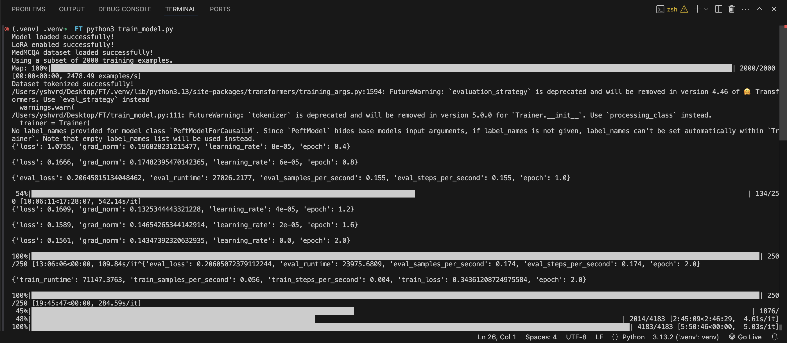
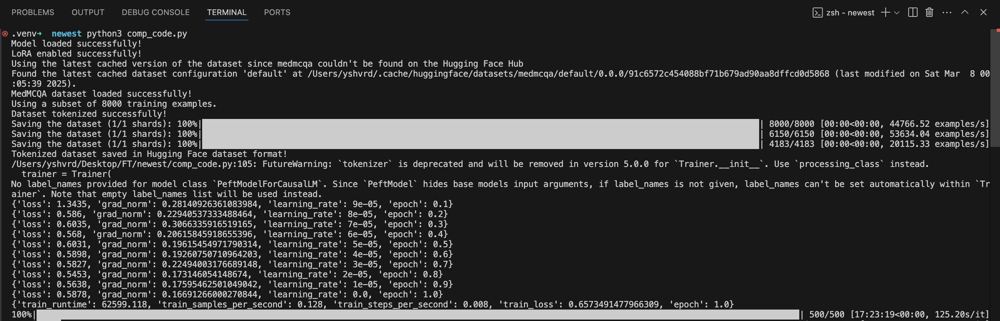

# Model Training 

The model is a pretrained LLaMA 3.2 1B, which is fine-tuned using LoRA (Low-Rank Adaptation) on the MedMCQA dataset.

## Results 

### Training Run - 1 

Training Time : ~25 Hours

### Training Run - 2

mps out of memory at epoch = 2, batch = 2 gradient =16/8